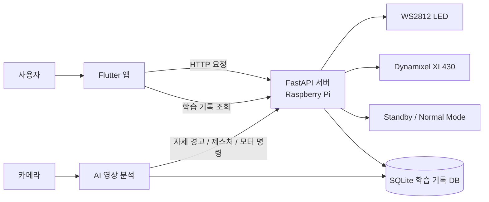
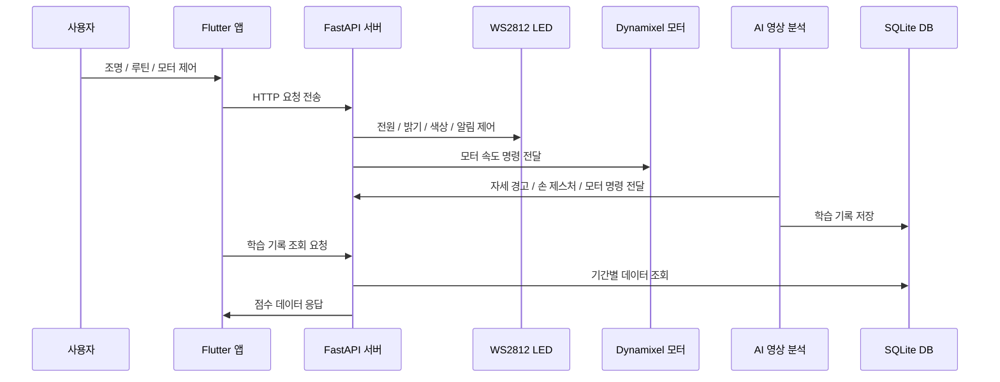

# Flow Lamp

## 1. 프로젝트 소개
Flow Lamp는 학습 환경에서 조명의 전원, 밝기, 위치를 더 편리하게 제어하기 위해 개발한 IoT 스마트 조명 프로젝트입니다. Flutter 앱과 FastAPI 서버, Raspberry Pi 5, 카메라, LED, Dynamixel 모터를 연동하여 사용자의 조작과 감지 결과에 따라 조명의 상태를 제어하도록 구현했습니다.

사용자는 앱을 통해 전원, 밝기, 위치, 야간 모드를 설정할 수 있으며, Raspberry Pi는 전달받은 명령을 기반으로 하드웨어를 제어합니다. 또한 카메라 기반 사용자 감지를 통해 사람이 감지되면 대기 모드에서 기본 모드로 전환되도록 설계했습니다.

이 프로젝트는 앱 개발, API 서버 구축, 임베디드 제어, 하드웨어 연동을 함께 경험한 IoT 기반 캡스톤 프로젝트입니다.

## 2. 개발 배경
책상에서 공부하거나 작업할 때 조명의 위치와 밝기는 사용자의 집중도와 시야 확보에 큰 영향을 줍니다. 하지만 일반적인 책상 조명은 사용자가 직접 전원을 켜고, 밝기와 각도를 조절해야 하며, 상황에 따라 반복적으로 조작해야 하는 불편함이 있습니다.

특히 조명 위치가 적절하지 않으면 손이나 물체로 인해 그림자가 생기거나, 빛이 눈에 직접 들어와 피로감을 유발할 수 있습니다. 또한 사용자가 자리를 비우거나 다시 착석했을 때 조명을 매번 수동으로 조작해야 하기 때문에 학습 흐름이 끊길 수 있습니다.

Flow Lamp는 이러한 문제를 해결하기 위해 사용자의 존재 여부를 감지하고, 앱을 통해 조명의 밝기와 위치를 쉽게 제어할 수 있는 스마트 조명 시스템으로 기획되었습니다. 이를 통해 사용자가 조명을 직접 조작하는 과정을 줄이고, 더 편리하고 집중하기 좋은 학습 환경을 제공하는 것을 목표로 했습니다.

## 3. 주요 기능
Flow Lamp는 Flutter 앱, FastAPI 서버, Raspberry Pi 기반 하드웨어 제어, AI 영상 분석 기능을 연동하여 조명 제어와 학습 상태 관리를 함께 수행하는 시스템입니다. 사용자는 앱에서 조명의 전원, 밝기, 색상, 야간 모드, 모터를 제어할 수 있으며, Raspberry Pi는 앱 명령과 영상 분석 결과를 바탕으로 LED, Dynamixel 모터, 학습 기록 데이터를 관리합니다.

### 3.1 앱 기반 조명 제어
Flutter 앱에서 조명의 주요 설정과 학습 보조 기능을 탭 구조로 제어할 수 있도록 구성했습니다. 사용자는 램프 제어, 알람 및 루틴, 데이터, 수동 제어 화면을 통해 조명 상태와 학습 데이터를 확인할 수 있습니다.

- 조명 전원 ON/OFF
- 조명 밝기 조절(0~100)
- 조명 색상 조절(RGB)
- 집중 타이머 설정 및 종료 알림
- 야간 모드 스케줄 설정
- 1번 / 4번 모터 수동 제어
- 집중 점수 / 자세 점수 / 종합 점수 데이터 확인

### 3.2 Raspberry Pi 기반 제어 서버
Raspberry Pi에서 FastAPI 서버를 실행하여 Flutter 앱, LED, Dynamixel 모터, AI 스크립트를 연결했습니다. 서버는 앱 요청을 처리하고, 조명 상태와 모드 정보를 관리하며, 영상 분석 결과를 받아 알림 및 제어 동작으로 연결합니다.

- FastAPI 기반 REST API 서버 구성
- 전원, 밝기, 색상, 야간 모드 상태 관리
- 모터 속도 제어 API 연동
- 타이머 종료 및 자세 경고 알림 처리
- 학습 기록 조회 API 제공

### 3.3 AI 기반 학습 상태 분석
카메라와 MediaPipe 기반 영상 분석을 활용하여 사용자의 자세, 졸음, 자리 이탈 상태를 감지하도록 구현했습니다. 분석 결과는 학습 기록 DB에 저장되며, 앱에서는 기간별 점수 데이터를 차트로 확인할 수 있습니다.

- 거북목 자세 감지 및 횟수 기록
- 눈 감김 기반 졸음 상태 감지
- 자리 이탈 횟수 및 이탈 시간 기록
- 자세 점수, 집중 점수, 종합 점수 계산
- 학습 기록 SQLite DB 저장 및 앱 차트 조회

### 3.4 LED 제어 및 알림
WS2812 LED를 SPI 방식으로 제어하여 전원, 밝기, 색상, 야간 모드 상태를 반영하도록 구현했습니다. 또한 집중 타이머 종료나 자세 경고 상황에서는 LED 점멸을 통해 사용자에게 알림을 제공합니다.

- 밝기 값 0~100 범위 제어
- RGB 색상 값 0~255 범위 제어
- 야간 모드 활성화 시 따뜻한 색상 적용
- 집중 타이머 종료 시 LED 점멸 알림
- 거북목 감지 시 자세 경고 LED 알림

### 3.5 Dynamixel 모터 기반 방향 제어
Dynamixel XL430 모터를 활용하여 조명의 조사 방향을 2축으로 조절할 수 있도록 구현했습니다. 앱에서는 1번과 4번 모터를 수동으로 제어할 수 있고, 손바닥 위치 추적 결과를 바탕으로 모터 이동 명령을 전달할 수 있습니다.

- X, Y 2축 기반 방향 제어
- 1번 / 4번 Dynamixel 모터 속도 제어
- 앱 버튼을 통한 수동 모터 이동 및 정지
- 손바닥 위치 기반 자동 추적 명령 처리
- 모터 제어 로직과 FastAPI 서버 연동

### 3.6 루틴 및 야간 모드 관리
앱에서 집중 타이머와 야간 모드 스케줄을 설정할 수 있도록 구성했습니다. Raspberry Pi는 저장된 시간 설정과 활성화 여부를 기준으로 야간 모드 상태를 관리하고, 집중 타이머가 종료되면 LED 알림을 실행합니다.

- 집중 타이머 시작 / 일시정지 / 재설정
- 타이머 종료 시 서버 알림 전송
- 야간 모드 ON/OFF 설정
- 시작 시간 및 종료 시간 설정
- 설정된 시간에 따른 조명 상태 관리
- 현재 야간 모드 상태 조회

### 3.7 모드 및 제스처 관리
Flow Lamp는 Standby Mode와 Normal Mode를 중심으로 조명 상태를 관리합니다. 또한 손 제스처를 활용하여 앱 조작 없이도 밝기 조절과 모터 추적 제어가 가능하도록 구성했습니다.

- Standby Mode: 조명 OFF 및 대기 상태
- Normal Mode: 조명 제어 동작 상태
- 전원 제어 및 감지 API에 따른 모드 전환 구조
- 주먹 회전 제스처 기반 밝기 증가 / 감소
- 손바닥 위치 기반 조명 방향 추적
- 책 상태(Open Book / Closed Book / No Book) 인식 보조 기능
- 현재 모드 상태 조회

## 4. 시스템 구조
Flow Lamp는 Flutter 앱이 사용자 인터페이스를 담당하고, Raspberry Pi에서 실행되는 FastAPI 서버가 중앙 제어 역할을 수행하는 구조입니다. 카메라 기반 AI 스크립트는 사용자의 자세, 졸음, 손 제스처, 책 상태를 분석하며, 분석 결과는 서버 API 또는 SQLite DB를 통해 조명 제어와 학습 데이터 관리에 반영됩니다.



### 4.1 전체 구성
시스템은 앱, 서버, AI 분석 모듈, 하드웨어 제어 모듈, 학습 기록 저장소로 구성됩니다.

- Flutter 앱: 조명 제어, 루틴 설정, 학습 데이터 조회, 모터 수동 제어 UI 제공
- FastAPI 서버: 앱 요청 처리, 조명 상태 관리, 모터 제어, AI 분석 결과 수신
- AI 영상 분석 모듈: 자세, 졸음, 자리 이탈, 손 제스처, 책 상태 분석
- 하드웨어 제어 모듈: WS2812 LED와 Dynamixel XL430 모터 제어
- SQLite DB: 날짜별 학습 기록과 자세 / 집중 점수 저장

### 4.2 앱과 서버 흐름
Flutter 앱은 Raspberry Pi에서 실행되는 FastAPI 서버로 HTTP 요청을 보내 조명과 모터를 제어합니다. 서버는 요청에 따라 LED 상태를 변경하거나 Dynamixel 모터 속도 명령을 전달하고, 현재 상태와 학습 기록 데이터를 앱에 응답합니다.

- 앱에서 전원, 밝기, 색상, 야간 모드 설정 요청
- 서버에서 LED 상태 및 모드 상태 갱신
- 앱에서 모터 수동 제어 요청
- 서버에서 1번 / 4번 Dynamixel 모터 속도 제어
- 앱에서 기간별 학습 기록 조회
- 서버에서 SQLite DB의 학습 기록 반환

### 4.3 AI 분석과 제어 흐름
카메라 영상은 AI 스크립트에서 분석되며, 분석 결과는 조명 제어와 학습 기록에 활용됩니다. 자세 경고나 손 제스처처럼 즉시 반응이 필요한 결과는 FastAPI 서버로 전달하고, 학습 점수와 통계 데이터는 SQLite DB에 저장합니다.

- 얼굴 / 자세 분석을 통한 거북목, 졸음, 자리 이탈 감지
- 거북목 감지 시 서버 API로 자세 경고 전달
- 손바닥 위치 추적을 통한 조명 방향 제어
- 주먹 회전 제스처를 통한 밝기 증가 / 감소
- 학습 시간, 순공부 시간, 자세 점수, 집중 점수 저장

### 4.4 하드웨어 제어 구조
Raspberry Pi는 LED와 모터를 직접 제어하는 하드웨어 제어 계층을 가집니다. LED는 SPI 기반으로 색상과 밝기를 제어하고, Dynamixel 모터는 속도 제어 방식으로 조명의 방향을 조정합니다.

- WS2812 LED: 전원, 밝기, RGB 색상, 야간 모드, 알림 점멸 제어
- Dynamixel XL430: 1번 / 4번 모터 기반 X, Y 2축 방향 제어
- Lamp Runtime: Standby Mode와 Normal Mode 상태 관리
- Night Checker: 설정된 시간에 따른 야간 모드 자동 적용

## 5. 기술 스택
Flow Lamp는 모바일 앱, API 서버, AI 영상 분석, 하드웨어 제어가 함께 동작하는 프로젝트이기 때문에 각 영역에 맞는 기술을 나누어 사용했습니다.

| 구분 | 기술 | 사용 목적 |
| --- | --- | --- |
| App | Flutter, Dart | 사용자 앱 UI 구현 |
| App 통신 | http | FastAPI 서버와 HTTP 통신 |
| App UI | fl_chart, progressive_time_picker, intl | 학습 데이터 차트, 야간 모드 시간 설정, 날짜 포맷 처리 |
| Backend | Python, FastAPI, Uvicorn | REST API 서버 구현 및 실행 |
| AI / Vision | OpenCV, MediaPipe | 카메라 영상 처리, 얼굴 / 자세 / 손 추적 |
| AI Model | TensorFlow, tf-keras | 책 상태 분류 모델 실행 |
| Database | SQLite | 날짜별 학습 기록 저장 |
| Hardware | Raspberry Pi 5 | 앱, 서버, AI, 하드웨어 제어 실행 환경 |
| LED Control | spidev | WS2812 LED SPI 제어 |
| Motor Control | Dynamixel SDK, pyserial | Dynamixel XL430 모터 제어 |
| GPIO | RPi.GPIO | PIR 센서 기반 움직임 감지 처리 |

### 5.1 Frontend
Flutter를 사용하여 조명 제어, 루틴 설정, 학습 데이터 조회, 수동 모터 제어 화면을 구성했습니다. 앱은 FastAPI 서버와 HTTP 방식으로 통신하며, 서버에서 받은 상태값과 학습 기록을 화면에 반영합니다.

- Flutter / Dart 기반 모바일 앱 구현
- `http` 패키지를 통한 REST API 요청 처리
- `fl_chart`를 활용한 학습 점수 차트 시각화
- `progressive_time_picker`를 활용한 야간 모드 시간 설정 UI 구현
- `intl`을 활용한 날짜 표시 및 기간 선택 데이터 처리

### 5.2 Backend
Raspberry Pi에서 FastAPI 서버를 실행하여 앱, AI 스크립트, 하드웨어 제어 모듈을 연결했습니다. 서버는 조명 상태, 모드 상태, 야간 모드 스케줄, 모터 제어, 학습 기록 조회 기능을 제공합니다.

- Python 기반 서버 로직 구현
- FastAPI 기반 REST API 구성
- Uvicorn을 통한 API 서버 실행
- Pydantic 모델을 활용한 요청 데이터 검증
- SQLite 학습 기록 조회 및 앱 응답 처리

### 5.3 AI / Computer Vision
카메라 영상 분석에는 OpenCV와 MediaPipe를 사용했습니다. 얼굴, 자세, 손 랜드마크를 기반으로 졸음, 거북목, 자리 이탈, 손 제스처를 감지하고, 책 상태 분류에는 TensorFlow / Keras 모델을 사용했습니다.

- OpenCV 기반 카메라 입력 및 프레임 처리
- MediaPipe Face Mesh를 활용한 눈 감김 / 졸음 감지
- MediaPipe Pose를 활용한 거북목 자세 분석
- MediaPipe Hands를 활용한 손바닥 추적 및 주먹 회전 제스처 인식
- TensorFlow / tf-keras 기반 책 상태 분류 모델 실행

### 5.4 Hardware Control
Raspberry Pi 5에서 LED와 Dynamixel 모터를 직접 제어했습니다. WS2812 LED는 SPI 통신을 통해 색상과 밝기를 제어하고, Dynamixel XL430 모터는 SDK와 시리얼 통신을 통해 속도 기반으로 제어합니다.

- Raspberry Pi 5 기반 임베디드 실행 환경 구성
- `spidev`를 활용한 WS2812 LED 제어
- Dynamixel SDK와 `pyserial`을 활용한 XL430 모터 제어
- 1번 / 4번 모터 기반 X, Y 2축 방향 제어
- GPIO 기반 PIR 센서 입력 처리를 위한 `RPi.GPIO` 사용

### 5.5 Data
학습 기록은 SQLite DB에 저장했습니다. AI 분석 결과를 바탕으로 날짜별 학습 시간, 순공부 시간, 자리 이탈 시간, 졸음 시간, 자세 점수, 집중 점수, 종합 점수를 기록하고 앱에서 기간별로 조회할 수 있도록 구성했습니다.

- SQLite 기반 로컬 DB 사용
- 날짜별 학습 기록 저장
- 자세 점수 / 집중 점수 / 종합 점수 계산 결과 저장
- FastAPI를 통한 기간별 학습 기록 조회

## 6. 하드웨어 구성
Flow Lamp의 하드웨어는 Raspberry Pi 5를 중심으로 LED, Dynamixel 모터, 카메라, 센서 모듈을 연결하는 구조입니다. Raspberry Pi는 서버 실행, AI 영상 분석, LED 출력, 모터 제어를 함께 담당하며, 앱에서 전달된 명령과 카메라 분석 결과를 실제 하드웨어 동작으로 변환합니다.

### 6.1 하드웨어 구성 요소
| 구분 | 부품 | 역할 | 연결 / 설정 |
| --- | --- | --- | --- |
| Main Controller | Raspberry Pi 5 | FastAPI 서버, AI 스크립트, 하드웨어 제어 실행 | Python 런타임 및 GPIO / SPI / USB 장치 사용 |
| Camera | Raspberry Pi Camera / USB Camera | 얼굴, 자세, 손 제스처, 책 상태 분석용 영상 입력 | `rpicam-vid`, V4L2 기반 카메라 입력 |
| LED | WS2812 LED Strip | 조명 출력, 야간 모드 색상, 타이머 / 자세 경고 알림 | SPI0 MOSI, GPIO10, 물리 19번 핀 |
| Motor | Dynamixel XL430 | 조명 조사 방향 조절 | 1번 / 4번 모터, Velocity Control Mode |
| Motor Interface | USB Serial / Dynamixel Interface | Raspberry Pi와 Dynamixel 모터 통신 | `/dev/ttyUSB*`, `/dev/ttyACM*`, `/dev/serial/by-id/*` 자동 탐색 |
| Sensor | PIR Sensor | 움직임 / 사람 접근 감지 보조 | GPIO17 입력 기준 |
| Storage | SQLite DB | 학습 기록 저장 | `ai/study_records.db` |

### 6.2 Raspberry Pi 5
Raspberry Pi 5는 프로젝트의 중앙 제어 장치로 사용했습니다. 앱과 통신하는 FastAPI 서버를 실행하고, AI 스크립트와 하드웨어 제어 모듈을 함께 구동합니다.

- FastAPI 서버 실행
- 카메라 기반 AI 영상 분석 스크립트 실행
- WS2812 LED SPI 제어
- Dynamixel 모터 시리얼 통신 제어
- SQLite 학습 기록 DB 관리
- 야간 모드 시간 체크 및 모드 상태 관리

### 6.3 LED 연결
조명은 WS2812 LED Strip을 사용하며, Raspberry Pi의 SPI 출력을 통해 제어합니다. LED는 전원, 밝기, RGB 색상, 야간 모드 색상, 알림 점멸에 활용됩니다.

- LED 종류: WS2812 LED Strip
- LED 개수 설정: 72개
- 제어 방식: SPI
- SPI Bus / Device: `0 / 0`
- 데이터 핀: SPI0 MOSI, GPIO10, 물리 19번 핀
- 색상 순서: GRB
- SPI 속도: 2,400,000 Hz

실제 LED Strip을 길게 사용할 경우 Raspberry Pi 전원 핀만으로 전원을 공급하지 않고, LED에 맞는 별도 전원을 사용하는 것이 안전합니다. 이때 Raspberry Pi와 LED 전원의 GND는 공통으로 연결해야 합니다.

### 6.4 Dynamixel 모터 연결
조명 방향 제어에는 Dynamixel XL430 모터를 사용했습니다. 현재 구현은 1번 모터와 4번 모터를 이용한 X, Y 2축 속도 제어 방식입니다.

- 모터 모델: Dynamixel XL430
- 사용 모터 ID: 1번, 4번
- 제어 방식: Velocity Control Mode
- Protocol Version: 2.0
- 기본 Baudrate: 57,600
- 기본 포트 탐색: `/dev/serial/by-id/*`, `/dev/ttyUSB*`, `/dev/ttyACM*`
- 기본 최대 속도: 20
- X축 이동: 1번 모터
- Y축 이동: 4번 모터

앱의 수동 제어 화면에서는 버튼을 누르는 동안 모터 속도 명령을 보내고, 버튼에서 손을 떼면 정지 명령을 전달합니다. AI 손바닥 추적 기능에서는 손 위치와 화면 중심의 차이를 계산하여 X, Y축 모터 속도로 변환합니다.

### 6.5 카메라 구성
카메라는 AI 분석 입력 장치로 사용됩니다. 얼굴 / 자세 분석과 손 제스처 / 책 상태 분석은 각각 카메라 프레임을 받아 처리하며, 분석 결과는 서버 API 또는 SQLite DB에 반영됩니다.

- 얼굴 / 자세 분석: Raspberry Pi 카메라 입력 사용
- 손 제스처 / 책 상태 분석: V4L2 카메라 입력 사용
- 얼굴 분석 해상도 기본값: 1280 x 720
- 손 제스처 분석 해상도 기본값: 640 x 480
- 기본 FPS: 15
- 분석 대상: 얼굴, 눈 감김, 자세, 손바닥 위치, 주먹 회전, 책 상태

### 6.6 PIR 센서 구성
PIR 센서 제어 모듈은 GPIO 입력을 통해 사람의 움직임을 감지할 수 있도록 구성했습니다. 현재 프로젝트에서는 카메라 기반 분석이 핵심 감지 방식이며, PIR 센서는 움직임 감지 보조 모듈로 사용할 수 있습니다.

- 센서 종류: PIR Sensor
- 기본 GPIO 핀: GPIO17
- 입력 방식: GPIO IN
- 기본 Pull 설정: Pull Down
- 기본 Debounce: 300ms
- 기본 Warm-up 시간: 2초

### 6.7 전원 및 연결 시 주의사항
LED와 모터는 Raspberry Pi보다 순간 전류 요구량이 클 수 있으므로 하드웨어 연결 시 전원 구성을 분리해서 고려해야 합니다. 특히 LED Strip과 Dynamixel 모터는 안정적인 동작을 위해 부품 사양에 맞는 별도 전원 사용이 필요합니다.

- Raspberry Pi, LED, 모터 전원의 GND 공통 연결
- LED Strip은 길이와 밝기에 맞는 별도 전원 사용
- Dynamixel 모터는 모터 사양에 맞는 전원 공급
- SPI 사용 전 Raspberry Pi에서 SPI 인터페이스 활성화
- Dynamixel 연결 전 포트 권한과 장치 인식 여부 확인
- 카메라 실행 전 Raspberry Pi 카메라 또는 USB 카메라 인식 확인

## 7. 앱 화면
Flow Lamp 앱은 하단 탭 구조로 구성되어 있으며, 사용자가 조명 제어, 루틴 설정, 학습 데이터 확인, 모터 수동 제어 기능을 화면별로 나누어 사용할 수 있도록 설계했습니다.

| 탭 | 화면명 | 주요 기능 |
| --- | --- | --- |
| 1 | 램프 제어 | 전원, 밝기, RGB 색상 제어 |
| 2 | 알람 및 루틴 | 집중 타이머, 야간 모드 스케줄 설정 |
| 3 | 데이터 | 기간별 집중 점수, 자세 점수, 종합 점수 조회 |
| 4 | 수동 제어 | 1번 / 4번 Dynamixel 모터 수동 제어 |

### 7.1 램프 제어 화면


램프 제어 화면에서는 조명의 기본 상태를 직접 조작할 수 있습니다. 앱 실행 시 서버에서 현재 조명 상태를 불러오고, 사용자가 변경한 전원, 밝기, 색상 값은 FastAPI 서버로 전달되어 Raspberry Pi의 LED 제어 로직에 반영됩니다.

- 조명 전원 ON/OFF 스위치
- 밝기 조절 슬라이더
- RGB 색상 조절 슬라이더
- 현재 RGB 값 기반 색상 미리보기
- 서버 상태값 기반 초기 화면 동기화

### 7.2 알람 및 루틴 화면
<!-- 이미지 추가 위치: 알람 및 루틴 화면 -->

알람 및 루틴 화면은 집중 타이머와 야간 모드 스케줄을 설정하는 화면입니다. 사용자는 집중 시간을 설정하고 타이머를 실행할 수 있으며, 타이머가 종료되면 서버에 알림 신호를 보내 LED 점멸로 종료를 알려줍니다.

- 집중 타이머 시간 설정
- 타이머 시작 / 일시정지
- 집중 시간 종료 시 서버 알림 전송
- 야간 모드 ON/OFF 설정
- 야간 모드 시작 시간 및 종료 시간 설정
- 설정된 야간 모드 시간 표시

### 7.3 데이터 화면
<!-- 이미지 추가 위치: 데이터 화면 -->

데이터 화면에서는 AI 분석 결과를 기반으로 저장된 학습 기록을 조회할 수 있습니다. 사용자는 기간을 선택하고, 집중 점수, 자세 점수, 종합 점수 중 원하는 항목을 선택하여 차트와 요약 데이터를 확인할 수 있습니다.

- 날짜 범위 선택
- 집중 점수 / 자세 점수 / 종합 점수 항목 전환
- 기간별 점수 라인 차트 표시
- 최고 점수, 최저 점수, 평균 점수 요약
- 학습 기록 새로고침
- 데이터 없음 / 통신 실패 상태 처리

### 7.4 수동 제어 화면
<!-- 이미지 추가 위치: 수동 제어 화면 -->

수동 제어 화면에서는 Dynamixel 모터를 직접 조작할 수 있습니다. 사용자는 1번과 4번 모터의 좌우 방향 버튼을 누르는 동안 모터를 이동시키고, 버튼에서 손을 떼면 정지 명령을 전송합니다.

- 1번 모터 수동 제어
- 4번 모터 수동 제어
- 버튼 누름 상태 기반 속도 명령 전송
- 버튼 해제 시 모터 정지 명령 전송
- 모터 제어 성공 / 실패 상태 메시지 표시

## 8. API 명세
Flow Lamp의 API 서버는 Raspberry Pi에서 FastAPI로 실행되며, Flutter 앱과 AI 스크립트가 HTTP 요청을 통해 조명, 모터, 모드, 학습 기록을 제어할 수 있도록 구성했습니다.

- 기본 주소: `http://<raspberry-pi-ip>:8000`
- 요청 형식: Query Parameter 또는 JSON Body
- 응답 형식: JSON
- 주요 클라이언트: Flutter 앱, AI 영상 분석 스크립트

### 8.1 API 목록
| Method | Endpoint | 설명 | 호출 주체 |
| --- | --- | --- | --- |
| GET | `/status` | 현재 조명 / 모드 상태 조회 | App |
| POST | `/power?status=on/off` | 조명 전원 및 모드 변경 | App |
| POST | `/brightness` | LED 밝기 설정 | App |
| POST | `/color` | LED RGB 색상 설정 | App |
| POST | `/timer/done` | 집중 타이머 종료 알림 | App |
| GET | `/night_mode/schedule` | 야간 모드 스케줄 조회 | App |
| POST | `/night_mode/schedule` | 야간 모드 스케줄 저장 | App |
| GET | `/study-records` | 기간별 학습 기록 조회 | App |
| POST | `/motors/{motor_id}/velocity` | 개별 모터 속도 제어 | App |
| POST | `/motors/xy` | X, Y축 모터 방향 제어 | AI |
| POST | `/motors/stop` | 전체 모터 정지 | App / AI |
| POST | `/mode/{mode_name}` | Standby / Normal 모드 변경 | App / Server |
| POST | `/vision/person` | 사용자 감지 상태 전달 | AI |
| POST | `/vision/posture` | 거북목 자세 경고 전달 | AI |
| POST | `/vision/gesture` | 손 제스처 기반 밝기 제어 | AI |

### 8.2 상태 조회
현재 조명 전원, 밝기, 색상, 야간 모드, 동작 모드, 사용자 감지 상태를 조회합니다.

```http
GET /status
```

응답 예시:

```json
{
  "mode": "normal",
  "power": true,
  "night_mode": false,
  "brightness": 80,
  "color": {
    "r": 255,
    "g": 128,
    "b": 64
  },
  "person_detected": false
}
```

### 8.3 조명 제어 API
조명의 전원, 밝기, 색상을 제어하는 API입니다. 앱의 램프 제어 화면에서 사용합니다.

#### 전원 제어
```http
POST /power?status=on
POST /power?status=off
```

- `status=on`: Normal Mode로 전환하고 LED ON
- `status=off`: Standby Mode로 전환하고 LED OFF

응답 예시:

```json
{
  "status": "success",
  "mode": "normal",
  "power": true
}
```

#### 밝기 설정
```http
POST /brightness
Content-Type: application/json
```

요청 예시:

```json
{
  "value": 80
}
```

- `value`: 0~100 범위의 밝기 값

응답 예시:

```json
{
  "status": "success",
  "brightness": 80
}
```

#### 색상 설정
```http
POST /color
Content-Type: application/json
```

요청 예시:

```json
{
  "r": 255,
  "g": 128,
  "b": 64
}
```

- `r`, `g`, `b`: 0~255 범위의 RGB 값

응답 예시:

```json
{
  "status": "success",
  "color": {
    "r": 255,
    "g": 128,
    "b": 64
  },
  "power": true
}
```

### 8.4 루틴 및 야간 모드 API
집중 타이머 종료 알림과 야간 모드 스케줄을 관리하는 API입니다.

#### 타이머 종료 알림
```http
POST /timer/done
```

집중 타이머가 종료되면 앱에서 호출하며, 서버는 LED 점멸 알림을 실행합니다.

응답 예시:

```json
{
  "status": "success",
  "action": "timer_alert"
}
```

#### 야간 모드 스케줄 조회
```http
GET /night_mode/schedule
```

응답 예시:

```json
{
  "is_on": true,
  "start_time": "23:00",
  "end_time": "06:00",
  "currently_active": false
}
```

#### 야간 모드 스케줄 저장
```http
POST /night_mode/schedule
Content-Type: application/json
```

요청 예시:

```json
{
  "is_on": true,
  "start_time": "23:00",
  "end_time": "06:00"
}
```

- `start_time`, `end_time`: `HH:MM` 형식

### 8.5 모터 제어 API
Dynamixel XL430 모터를 제어하는 API입니다. 앱의 수동 제어 화면과 AI 손바닥 추적 기능에서 사용합니다.

#### 개별 모터 속도 제어
```http
POST /motors/{motor_id}/velocity
Content-Type: application/json
```

요청 예시:

```json
{
  "velocity": 20
}
```

- `motor_id`: 제어할 모터 ID
- `velocity`: -100~100 범위의 속도 값
- 현재 프로젝트 사용 모터: 1번, 4번

응답 예시:

```json
{
  "status": "success",
  "motor": {
    "id": 1,
    "position": 2048,
    "goal_velocity": 20,
    "disabled": false,
    "error": null
  }
}
```

#### X, Y축 모터 제어
```http
POST /motors/xy
Content-Type: application/json
```

요청 예시:

```json
{
  "x": 0.5,
  "y": -0.3,
  "speed": 20
}
```

- `x`, `y`: -1.0~1.0 범위의 방향 값
- `speed`: 0~100 범위의 속도 값
- X축은 1번 모터, Y축은 4번 모터로 매핑

#### 전체 모터 정지
```http
POST /motors/stop
```

모든 Dynamixel 모터의 목표 속도를 0으로 설정합니다.

### 8.6 모드 관리 API
조명의 동작 모드를 직접 변경하는 API입니다.

```http
POST /mode/{mode_name}
```

- `mode_name`: `standby` 또는 `normal`
- `standby`: 조명 OFF 및 대기 상태
- `normal`: 조명 ON 및 제어 동작 상태

응답 예시:

```json
{
  "mode": "standby"
}
```

### 8.7 AI 연동 API
AI 영상 분석 스크립트가 분석 결과를 서버에 전달하기 위해 사용하는 API입니다.

#### 사용자 감지 상태 전달
```http
POST /vision/person
Content-Type: application/json
```

요청 예시:

```json
{
  "detected": true
}
```

- `detected=true`: Normal Mode로 전환
- `detected=false`: 일정 시간 후 Standby Mode 전환 예약

#### 자세 경고 전달
```http
POST /vision/posture
Content-Type: application/json
```

요청 예시:

```json
{
  "turtle_neck": true
}
```

- `turtle_neck=true`: 자세 경고 LED 점멸 시작
- `turtle_neck=false`: 자세 경고 LED 점멸 중지

응답 예시:

```json
{
  "status": "success",
  "turtle_neck": true,
  "action": "posture_alert_started"
}
```

#### 손 제스처 밝기 제어
```http
POST /vision/gesture
Content-Type: application/json
```

요청 예시:

```json
{
  "gesture": "brightness_up"
}
```

- `brightness_up`: 현재 밝기에서 10 증가
- `brightness_down`: 현재 밝기에서 10 감소

응답 예시:

```json
{
  "gesture": "brightness_up",
  "action": "brightness_changed",
  "brightness": 90
}
```

### 8.8 학습 기록 API
SQLite DB에 저장된 날짜별 학습 기록을 조회하는 API입니다. 앱의 데이터 화면에서 기간별 차트 표시를 위해 사용합니다.

```http
GET /study-records?start_date=2026-05-01&end_date=2026-05-31
```

- `start_date`: 조회 시작 날짜
- `end_date`: 조회 종료 날짜
- 날짜 형식: `YYYY-MM-DD`

응답 예시:

```json
{
  "start_date": "2026-05-01",
  "end_date": "2026-05-31",
  "count": 1,
  "records": [
    {
      "study_date": "2026-05-01",
      "posture_score": 40,
      "focus_score": 45,
      "total_score": 85
    }
  ]
}
```

## 9. 동작 흐름
Flow Lamp는 사용자의 앱 조작과 카메라 기반 AI 분석 결과를 Raspberry Pi의 FastAPI 서버가 받아 처리하고, 그 결과를 LED, Dynamixel 모터, SQLite DB에 반영하는 방식으로 동작합니다.



### 9.1 앱 기반 조명 제어 흐름
사용자가 앱에서 전원, 밝기, 색상을 변경하면 Flutter 앱이 FastAPI 서버로 요청을 전송하고, 서버는 LED 제어 모듈을 통해 실제 조명 상태를 변경합니다.

1. 사용자가 앱의 램프 제어 화면에서 전원, 밝기, RGB 값을 조작합니다.
2. Flutter 앱이 `/power`, `/brightness`, `/color` API로 요청을 보냅니다.
3. FastAPI 서버가 요청 값을 검증하고 현재 조명 상태를 갱신합니다.
4. LED 제어 모듈이 WS2812 LED에 색상과 밝기 값을 적용합니다.
5. 서버가 변경된 상태를 앱에 응답합니다.
6. 앱은 응답 값을 기반으로 화면 상태를 동기화합니다.

### 9.2 집중 타이머 및 야간 모드 흐름
집중 타이머는 앱 내부에서 진행되며, 타이머가 종료되면 서버로 알림을 보내 LED 점멸을 실행합니다. 야간 모드는 앱에서 설정한 스케줄을 Raspberry Pi가 저장하고, 현재 시간이 설정 범위에 포함되는지 주기적으로 확인하여 적용합니다.

1. 사용자가 알람 및 루틴 화면에서 집중 시간을 설정합니다.
2. 타이머가 종료되면 앱이 `/timer/done` API를 호출합니다.
3. 서버가 LED 점멸 알림을 실행합니다.
4. 사용자가 야간 모드 시작 시간과 종료 시간을 설정합니다.
5. 앱이 `/night_mode/schedule` API로 스케줄을 저장합니다.
6. Raspberry Pi의 Night Checker가 설정 시간에 따라 야간 모드 활성 여부를 판단합니다.
7. 야간 모드가 활성화되면 LED 색상이 따뜻한 색상으로 변경됩니다.

### 9.3 AI 자세 분석 및 경고 흐름
얼굴 / 자세 분석 스크립트는 카메라 프레임을 기반으로 거북목, 졸음, 자리 이탈 상태를 감지합니다. 거북목이 감지되면 서버에 자세 경고를 전달하고, 서버는 LED 경고 점멸을 실행합니다.

1. 카메라에서 사용자 영상을 입력받습니다.
2. OpenCV가 프레임을 읽고 MediaPipe가 얼굴 / 자세 랜드마크를 분석합니다.
3. 눈 감김 상태를 기반으로 졸음을 감지합니다.
4. 귀와 어깨 위치를 기반으로 목 각도를 계산하여 거북목을 감지합니다.
5. 사용자가 화면에서 사라진 시간을 기반으로 자리 이탈을 기록합니다.
6. 거북목 상태가 일정 시간 이상 지속되면 AI 스크립트가 `/vision/posture` API를 호출합니다.
7. 서버가 LED 자세 경고 점멸을 시작하거나 중지합니다.
8. 학습 종료 시 자세 점수, 집중 점수, 종합 점수를 계산하여 SQLite DB에 저장합니다.

### 9.4 손 제스처 및 모터 제어 흐름
손 제스처 분석 스크립트는 손바닥 위치와 주먹 회전 각도를 분석하여 조명 방향과 밝기를 제어합니다. 손바닥이 감지되면 모터 이동 명령을 보내고, 주먹 회전이 감지되면 밝기 증가 / 감소 명령을 서버에 전달합니다.

1. 카메라에서 손 영상을 입력받습니다.
2. MediaPipe Hands가 손 랜드마크를 추출합니다.
3. 손바닥 중심과 화면 중심의 차이를 계산합니다.
4. 차이 값을 X, Y축 방향 값으로 변환합니다.
5. AI 스크립트가 `/motors/xy` API로 모터 이동 명령을 전송합니다.
6. 서버가 1번 / 4번 Dynamixel 모터에 속도 명령을 전달합니다.
7. 주먹 회전이 감지되면 `/vision/gesture` API로 밝기 증가 / 감소 명령을 전송합니다.
8. 서버가 LED 밝기를 10 단위로 증가하거나 감소시킵니다.

### 9.5 학습 기록 저장 및 조회 흐름
AI 분석 결과는 날짜별 학습 기록으로 SQLite DB에 저장됩니다. 앱의 데이터 화면에서는 사용자가 선택한 기간에 해당하는 학습 기록을 서버에서 조회하여 차트와 요약 값으로 표시합니다.

1. AI 분석 스크립트가 학습 시간, 순공부 시간, 자리 이탈 시간, 졸음 시간, 자세 상태를 누적합니다.
2. 학습 종료 시 자세 점수, 집중 점수, 종합 점수를 계산합니다.
3. 계산된 결과를 `ai/study_records.db`에 저장하거나 기존 날짜 기록에 누적합니다.
4. 사용자가 앱의 데이터 화면에서 날짜 범위를 선택합니다.
5. 앱이 `/study-records` API로 기간별 학습 기록을 요청합니다.
6. 서버가 SQLite DB에서 해당 기간의 기록을 조회합니다.
7. 앱이 집중 점수, 자세 점수, 종합 점수를 차트와 요약 값으로 표시합니다.

### 9.6 모드 전환 흐름
Flow Lamp는 Standby Mode와 Normal Mode를 중심으로 조명 상태를 관리합니다. 전원 제어 API 또는 사용자 감지 API를 통해 모드가 변경되며, 각 모드에 진입할 때 LED 상태가 함께 변경됩니다.

1. 시스템 시작 시 기본적으로 Standby Mode에 진입합니다.
2. Standby Mode에서는 LED가 꺼진 대기 상태가 됩니다.
3. 앱에서 전원을 켜거나 사용자 감지 API가 호출되면 Normal Mode로 전환됩니다.
4. Normal Mode에 진입하면 LED가 켜지고 조명 제어가 가능한 상태가 됩니다.
5. 앱에서 전원을 끄거나 사용자 부재가 일정 시간 유지되면 Standby Mode로 전환됩니다.

## 10. 프로젝트 구조
Flow Lamp 프로젝트는 Flutter 앱, Raspberry Pi 서버 / 하드웨어 제어 코드, AI 영상 분석 코드, 테스트 코드로 나누어 구성되어 있습니다.

```text
FlowLamp/
|-- README.md
|-- requirements.txt
|-- ai/
|   |-- facetest.py
|   |-- handtest.py
|   |-- booktest.py
|   |-- show_db.py
|   |-- keras_model.h5
|   |-- labels.txt
|   `-- study_records.db
|-- flowlamp_app/
|   |-- pubspec.yaml
|   |-- assets/
|   |-- lib/
|   |   |-- main.dart
|   |   |-- main_screen.dart
|   |   |-- alarm.dart
|   |   |-- models/
|   |   |   `-- study_record.dart
|   |   |-- screens/
|   |   |   |-- tab1_control.dart
|   |   |   |-- tab2_routine.dart
|   |   |   |-- tab3_data.dart
|   |   |   `-- tab4_manual.dart
|   |   |-- services/
|   |   |   `-- flowlamp_api.dart
|   |   `-- widgets/
|   `-- test/
|-- flowlamp_rpi/
|   |-- main.py
|   |-- api.py
|   |-- study_records.py
|   |-- devices/
|   |   |-- led.py
|   |   |-- motor.py
|   |   `-- sensor.py
|   |-- modes/
|   |   |-- normal_mode.py
|   |   |-- standby_mode.py
|   |   `-- test_mode.py
|   `-- controls/
`-- test/
    |-- camera_web.py
    |-- led_test.py
    |-- test_motor.py
    |-- test_study_records.py
    |-- requirements.txt
    `-- README.md
```

### 10.1 최상위 구조
프로젝트 최상위에는 앱, Raspberry Pi 제어 코드, AI 분석 코드, 테스트 코드가 분리되어 있습니다.

- `README.md`: 프로젝트 소개 및 포트폴리오 문서
- `requirements.txt`: Python 서버 / AI / 하드웨어 제어 의존성 목록
- `flowlamp_app/`: Flutter 기반 사용자 앱
- `flowlamp_rpi/`: Raspberry Pi에서 실행되는 서버 및 하드웨어 제어 코드
- `ai/`: 카메라 기반 AI 영상 분석 코드와 학습 기록 DB
- `test/`: 하드웨어 및 저장소 동작 확인용 테스트 코드

### 10.2 Flutter 앱 구조
`flowlamp_app` 디렉터리는 사용자 앱을 담당합니다. 앱은 하단 탭 구조로 구성되어 있으며, 각 화면은 `lib/screens` 아래에 분리했습니다.

- `main.dart`: Flutter 앱 진입점
- `main_screen.dart`: 하단 탭 기반 메인 화면
- `screens/tab1_control.dart`: 램프 전원, 밝기, RGB 색상 제어 화면
- `screens/tab2_routine.dart`: 집중 타이머 및 야간 모드 화면
- `screens/tab3_data.dart`: 학습 점수 차트 및 기간별 데이터 화면
- `screens/tab4_manual.dart`: Dynamixel 모터 수동 제어 화면
- `services/flowlamp_api.dart`: FastAPI 서버와 통신하는 API 클라이언트
- `models/study_record.dart`: 학습 기록 데이터 모델
- `widgets/`: 타이머, 야간 모드 카드 등 재사용 UI 컴포넌트

### 10.3 Raspberry Pi 서버 구조
`flowlamp_rpi` 디렉터리는 Raspberry Pi에서 실행되는 서버와 하드웨어 제어 계층을 담당합니다.

- `main.py`: 서버, 런타임, 야간 모드 체크, AI 스크립트 실행을 관리하는 메인 파일
- `api.py`: FastAPI 라우트와 요청 / 응답 로직 정의
- `study_records.py`: SQLite 학습 기록 조회 로직
- `devices/led.py`: WS2812 LED 제어 로직
- `devices/motor.py`: Dynamixel XL430 모터 제어 로직
- `devices/sensor.py`: PIR 센서 GPIO 입력 처리 로직
- `modes/standby_mode.py`: 대기 모드 동작
- `modes/normal_mode.py`: 기본 조명 제어 모드 동작
- `modes/test_mode.py`: 테스트용 모드 동작

### 10.4 AI 분석 구조
`ai` 디렉터리는 카메라 영상 분석과 학습 기록 저장을 담당합니다.

- `facetest.py`: 얼굴 / 자세 분석, 졸음 감지, 거북목 감지, 자리 이탈 기록, 점수 계산
- `handtest.py`: 손바닥 추적, 주먹 회전 제스처, 모터 / 밝기 제어 연동
- `booktest.py`: TensorFlow / Keras 기반 책 상태 분류
- `keras_model.h5`: 책 상태 분류 모델 파일
- `labels.txt`: 책 상태 분류 라벨 파일
- `study_records.db`: 날짜별 학습 기록 SQLite DB
- `show_db.py`: 저장된 학습 기록 확인용 스크립트

### 10.5 테스트 구조
`test` 디렉터리는 하드웨어 연결과 주요 로직을 확인하기 위한 테스트 파일을 포함합니다.

- `led_test.py`: WS2812 LED SPI 출력 테스트
- `test_motor.py`: Dynamixel 모터 제어 로직 테스트
- `test_study_records.py`: SQLite 학습 기록 조회 로직 테스트
- `camera_web.py`: 카메라 스트림 확인용 웹 테스트
- `test/README.md`: Raspberry Pi 장치 테스트 실행 안내

## 11. 실행 방법
Flow Lamp는 Raspberry Pi에서 FastAPI 서버와 하드웨어 제어 코드를 실행하고, Flutter 앱에서 Raspberry Pi 서버로 HTTP 요청을 보내는 방식으로 실행합니다.

### 11.1 실행 전 준비
Raspberry Pi에서 서버와 하드웨어 제어 코드를 실행하기 전에 Python 의존성과 하드웨어 인터페이스를 준비합니다.

- Raspberry Pi 5 준비
- Python 가상환경 준비
- SPI 인터페이스 활성화
- 카메라 연결 확인
- Dynamixel 모터 및 USB Serial 장치 연결 확인
- Flutter 개발 환경 준비

SPI를 사용하는 WS2812 LED 제어를 위해 Raspberry Pi에서 SPI를 활성화합니다.

```bash
sudo raspi-config
```

`Interface Options` -> `SPI` -> `Enable`을 선택한 뒤 재부팅합니다.

SPI 장치가 보이는지 확인합니다.

```bash
ls /dev/spidev*
```

### 11.2 Python 서버 환경 설정
프로젝트 루트에서 Python 가상환경을 생성하고 필요한 패키지를 설치합니다.

```bash
python3 -m venv venv311
source venv311/bin/activate
pip install -r requirements.txt
```

주요 Python 패키지는 FastAPI, Uvicorn, OpenCV, MediaPipe, TensorFlow, Dynamixel SDK, spidev 등입니다.

### 11.3 Raspberry Pi 서버 실행
Raspberry Pi에서 FastAPI 서버, 런타임 모드, 야간 모드 체크, AI 스크립트를 함께 실행합니다.

```bash
source venv311/bin/activate
python flowlamp_rpi/main.py
```

기본 실행 시 서버는 다음 주소로 실행됩니다.

```text
http://0.0.0.0:8000
```

앱에서는 Raspberry Pi의 실제 IP 주소를 사용합니다.

```text
http://<raspberry-pi-ip>:8000
```

카메라나 AI 스크립트를 실행하지 않고 API 서버와 하드웨어 제어만 확인하고 싶을 때는 다음처럼 실행할 수 있습니다.

```bash
FLOWLAMP_ENABLE_VISION=0 python flowlamp_rpi/main.py
```

포트나 호스트를 변경할 때는 환경 변수를 사용합니다.

```bash
FLOWLAMP_HOST=0.0.0.0 FLOWLAMP_PORT=8000 python flowlamp_rpi/main.py
```

### 11.4 Flutter 앱 실행
Flutter 앱 디렉터리로 이동한 뒤 의존성을 설치하고 앱을 실행합니다.

```bash
cd flowlamp_app
flutter pub get
flutter run
```

앱에서 사용할 API 서버 주소를 직접 지정하려면 `FLOWLAMP_API_BASE` 값을 전달합니다.

```bash
flutter run --dart-define=FLOWLAMP_API_BASE=http://<raspberry-pi-ip>:8000
```

앱의 기본 서버 주소는 코드상 `http://172.20.10.6:8000`으로 설정되어 있으므로, Raspberry Pi의 IP가 다를 경우 위 옵션으로 서버 주소를 맞춰 실행해야 합니다.

### 11.5 AI 스크립트 개별 실행
메인 서버 실행 시 기본적으로 얼굴 / 자세 분석과 손 제스처 분석 스크립트가 함께 실행됩니다. 필요하면 스크립트를 개별로 실행하여 테스트할 수 있습니다.

얼굴 / 자세 / 졸음 분석:

```bash
python ai/facetest.py
```

손 제스처 / 모터 추적 / 책 상태 분석:

```bash
python ai/handtest.py
```

책 상태 분류 모델 테스트:

```bash
python ai/booktest.py
```

AI 스크립트가 서버에 요청을 보내야 하는 경우 API 주소를 환경 변수로 지정합니다.

```bash
FLOWLAMP_API_URL=http://127.0.0.1:8000 python ai/handtest.py
```

### 11.6 하드웨어 테스트
LED, 모터, 학습 기록 조회 로직은 테스트 파일을 통해 개별 확인할 수 있습니다.

LED SPI 출력 테스트:

```bash
cd test
python led_test.py
```

Dynamixel 모터 제어 로직 테스트:

```bash
python -m unittest test/test_motor.py
```

학습 기록 DB 조회 로직 테스트:

```bash
python -m unittest test/test_study_records.py
```

카메라 스트림 테스트:

```bash
python test/camera_web.py --port 8080
```

브라우저에서 다음 주소로 접속합니다.

```text
http://<raspberry-pi-ip>:8080
```

### 11.7 주요 환경 변수
실행 환경에 따라 다음 환경 변수를 사용할 수 있습니다.

| 환경 변수 | 기본값 | 설명 |
| --- | --- | --- |
| `FLOWLAMP_HOST` | `0.0.0.0` | FastAPI 서버 호스트 |
| `FLOWLAMP_PORT` | `8000` | FastAPI 서버 포트 |
| `FLOWLAMP_API_URL` | `http://127.0.0.1:8000` | AI 스크립트가 호출할 API 주소 |
| `FLOWLAMP_API_BASE` | `http://172.20.10.6:8000` | Flutter 앱에서 사용할 API 주소 |
| `FLOWLAMP_ENABLE_VISION` | `1` | AI 스크립트 전체 실행 여부 |
| `FLOWLAMP_ENABLE_FACE_AI` | `1` | 얼굴 / 자세 분석 실행 여부 |
| `FLOWLAMP_ENABLE_HAND_AI` | `1` | 손 제스처 분석 실행 여부 |
| `FLOWLAMP_STUDY_DB` | `ai/study_records.db` | 학습 기록 DB 경로 |
| `FLOWLAMP_DXL_PORT` | 자동 탐색 | Dynamixel 연결 포트 |
| `CAMERA_INDEX` | 스크립트별 기본값 | 사용할 카메라 인덱스 |

## 12. 문제 해결 과정
Flow Lamp는 앱, 서버, AI, 하드웨어가 함께 동작하는 프로젝트이기 때문에 각 영역을 연결하는 과정에서 여러 문제를 해결해야 했습니다.

### 12.1 앱과 서버 통신 주소 문제
Flutter 앱은 Raspberry Pi에서 실행되는 FastAPI 서버와 HTTP로 통신해야 합니다. 하지만 개발 환경과 실제 Raspberry Pi 환경의 IP 주소가 달라 앱에서 서버에 접속하지 못하는 문제가 발생할 수 있었습니다.

- 문제: 앱에 고정된 서버 주소가 실제 Raspberry Pi IP와 다르면 API 요청 실패
- 해결: `String.fromEnvironment`를 사용해 `FLOWLAMP_API_BASE` 값으로 API 주소를 외부에서 주입할 수 있도록 구성
- 결과: 실행 시 `--dart-define=FLOWLAMP_API_BASE=http://<raspberry-pi-ip>:8000` 옵션으로 환경에 맞게 서버 주소 변경 가능

### 12.2 하드웨어가 없는 환경에서의 실행 문제
개발 중에는 모든 환경에서 LED, SPI, Dynamixel SDK가 항상 준비되어 있지 않았습니다. 이 상태에서 서버가 바로 종료되면 앱과 API 로직을 테스트하기 어려웠습니다.

- 문제: SPI 라이브러리나 장치가 없을 때 LED 제어 코드 실행이 어려움
- 해결: LED 제어 모듈에서 `spidev` 또는 `/dev/spidev0.0` 장치가 없으면 시뮬레이션 모드로 동작하도록 처리
- 결과: Raspberry Pi 하드웨어가 완전히 준비되지 않은 상태에서도 API 서버와 앱 통신 흐름을 먼저 검증할 수 있음

### 12.3 Dynamixel 모터 제어 방식 정리
초기에는 조명 위치 제어를 위치값 기반으로 표현하기 쉬웠지만, 실제 구현은 1번과 4번 Dynamixel 모터를 속도 기반으로 제어하는 방식이었습니다.

- 문제: X, Y, Z 위치 제어처럼 표현하면 실제 구현과 맞지 않음
- 해결: 모터 제어를 `Velocity Control Mode` 기반의 X, Y 2축 방향 제어로 정리
- 결과: 앱 수동 제어와 손바닥 추적 제어 모두 1번 / 4번 모터의 속도 명령으로 일관되게 처리

### 12.4 손 추적 기반 모터 제어 안정화
손바닥 위치를 바로 모터 속도로 변환하면 작은 손 떨림에도 모터가 계속 움직이는 문제가 생길 수 있었습니다.

- 문제: 카메라 인식 좌표가 흔들리면 모터 명령이 과하게 자주 발생
- 해결: Dead Zone, 축 값 smoothing, 명령 전송 간격을 적용하여 작은 변화는 무시하고 움직임을 완화
- 결과: 손바닥 위치 기반 조명 방향 제어가 더 안정적으로 동작

### 12.5 자세 경고 LED 점멸 처리
거북목 자세가 감지되었을 때 LED를 점멸시키는 기능은 API 요청 처리와 동시에 동작해야 했습니다. 점멸 로직이 API 흐름을 막으면 앱이나 AI 스크립트의 다음 요청 처리가 지연될 수 있었습니다.

- 문제: LED 점멸이 동기적으로 실행되면 API 응답 지연 가능
- 해결: 자세 경고와 타이머 종료 알림을 별도 thread에서 실행하도록 구성
- 결과: LED 알림이 실행되는 동안에도 FastAPI 서버가 다른 요청을 계속 처리할 수 있음

### 12.6 야간 모드 시간 계산
야간 모드는 보통 `23:00 ~ 06:00`처럼 날짜를 넘어가는 시간 범위를 사용합니다. 단순히 시작 시간이 종료 시간보다 작다고 가정하면 자정 이후의 야간 모드를 정확히 판단하기 어렵습니다.

- 문제: 자정을 넘어가는 시간 범위에서 야간 모드 활성 여부 계산 오류 가능
- 해결: 시작 시간이 종료 시간보다 늦은 경우, 현재 시간이 시작 시간 이후이거나 종료 시간 이전이면 야간 모드로 판단
- 결과: `23:00 ~ 06:00` 같은 야간 스케줄도 정상적으로 처리

### 12.7 학습 기록 누적 및 조회
AI 분석 결과는 날짜별로 저장되어야 하고, 같은 날짜에 여러 번 실행하더라도 기존 기록과 자연스럽게 누적되어야 했습니다.

- 문제: 같은 날짜의 학습 기록이 중복 저장되거나 이전 기록이 덮어써질 수 있음
- 해결: `study_date`를 기준으로 기존 기록을 조회한 뒤, 존재하면 횟수와 시간을 누적하고 점수를 다시 계산
- 결과: 날짜별 학습 기록을 안정적으로 누적하고, 앱에서 기간별로 조회 가능

### 12.8 앱 데이터 화면 예외 처리
학습 기록이 없거나 서버와 통신할 수 없는 경우에도 앱 화면이 멈추지 않고 사용자에게 상태를 보여줘야 했습니다.

- 문제: 데이터가 없거나 API 요청이 실패하면 차트 화면 구성 중 오류 발생 가능
- 해결: 로딩, 빈 데이터, 통신 실패 상태를 분리하여 화면에 표시
- 결과: 학습 기록이 없는 기간을 선택하거나 서버 연결에 실패해도 앱이 안정적으로 동작

## 13. 팀원 및 담당 역할
## 14. 향후 개선점
